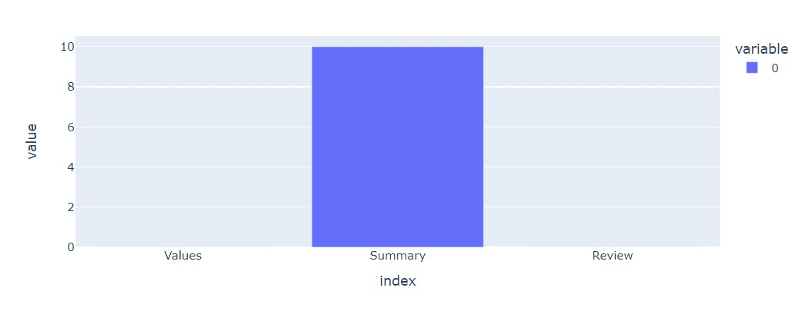
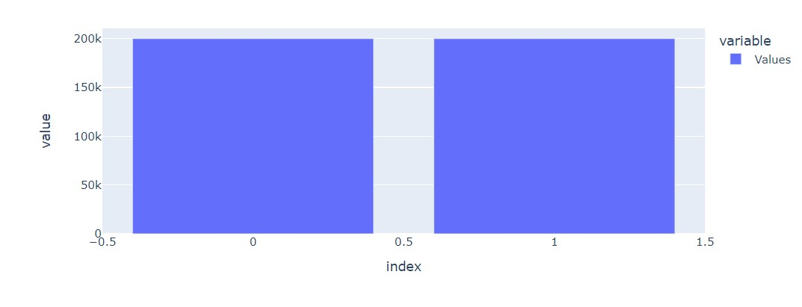
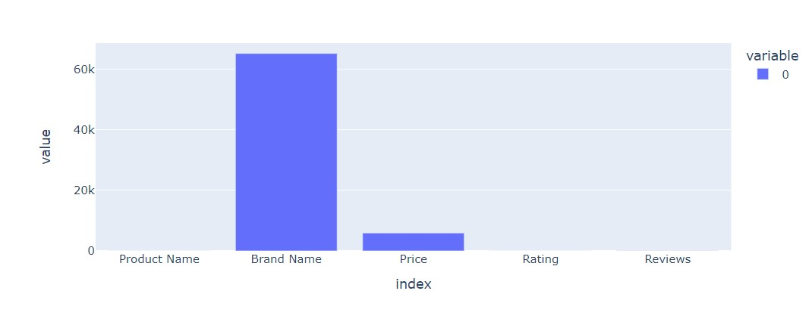
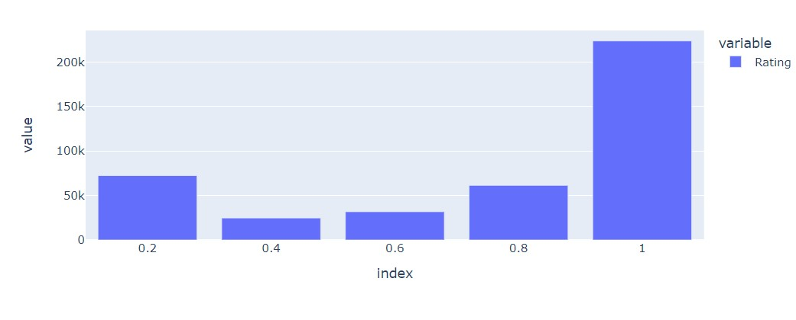
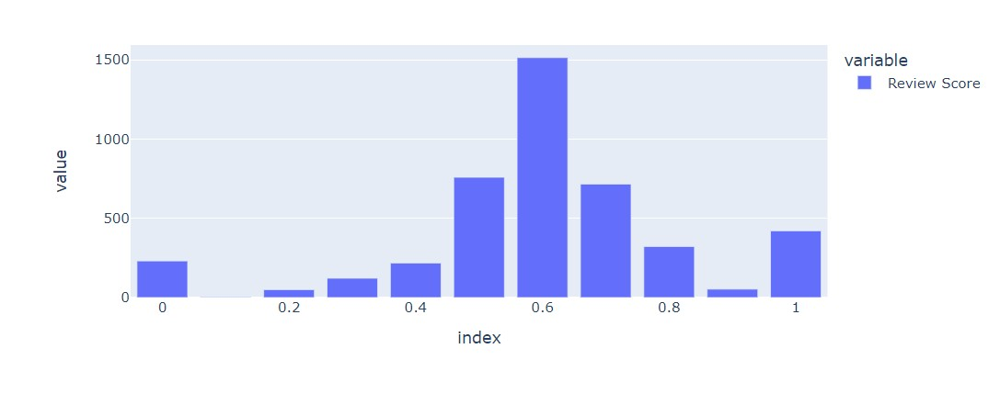
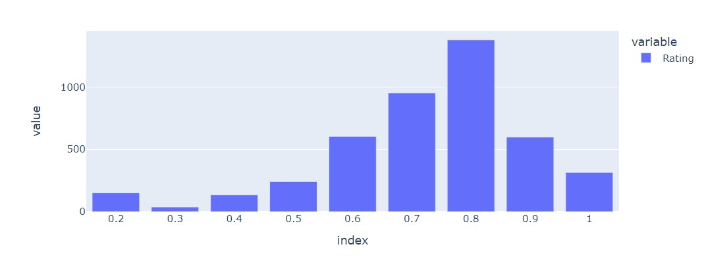
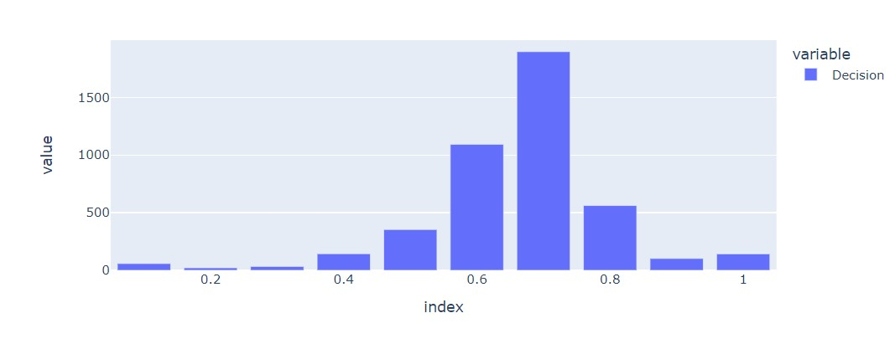

<h1>Review-Analysis-System</h1>

A computing for data science project that will input the reviews and ratings of a product and will create a score that can be used for decision making while buying the product.

<h2>Personal Details</h2>
<ul>
  <li>Name: Daniel Pereira</li>
  <li>Roll number: 10</li>
  <li>UID: 2309013</li>
</ul>

<h2>Project Objectives</h2>
<ul>
  <li>To create a system that helps in decision making while buying a product</li>
  <li>To create a review classifier to classify reviews as positive and negative</li>
  <li>To provide customers a choice instead of having a fixed decision</li>
  <li>To test this system by analysing a dataset containing multiple customer ratings and reviews of the same product.</li>
</ul>
<h2>Data Collection</h2>

The data needed for this project can be summarized in two datasets

<ol>
  <li>Training Data: This is the data that will be used for training the Review Classifier(Sentinental Analysis Model). For the training, we will need a dataset containing reviews and an indicator whether they are positive or not. This data is optional as the model is already trained and there is the default Sentinental Analysis CLassifier in the nltk package</li>
  <li>Review Data: For the testing of the system, we will need a dataset with the product, review and ratings. It is preferred to have multiple reviews by different customers for the same product. </li>
</ol>

<h2>Data Exploration</h2>
<ul>
  <li>For the training, I have a used a customer review dataset containing the review, a summary of the review and whether it is positive or negative. The datset is available on Kaggle.</li>
  <li>For the testing the system, I have used a Amazon customer review dataset that contains the product, price, review and rating. This dataset too is available on Kaggle.</li>
</ul>

<h2>Data Preparation</h2>
  <li>For the training data, the summary column has been dropped. There is no missing data in the reviews and values columns. The values in the value column have been transformed from 2 for postive and 1 for negative to 1 for positive and 1 for negative.  
  
  
  </li>  
  <li>For the amazon review dataset, except for the product name, rating and review, all columns are dropped. The missing data is removed as it is comparably small compared to the entire dataset. The ratings have been converted from 1-5 to 0-1. 
   
  
  </li>

<h2>Analysis Methods</h2>
<ul>
  <li>
    <b><u>MultinomialNB:</u></b> The MultinomialNB is a machine learning algorithm based on the Naive Bayes algorithm used for classifying text. We will be using this algorithm for creating the review classifier.
  </li>
  <li>
    <b><u>Statistical Techniques:</u></b> A few Statistical techniques like mean along with graphical visualization techniques like bar graph will be used for analysing the data.
  </li>
</ul>

<h2>Model Evaluation</h2>

The model evaluation is as follows:

<table>
  <tr>
    <td>Accuracy</td>
    <td>0.82</td>
  </tr>
  <tr>
    <td>Precision</td>
    <td>0.82</td>
  </tr>
  <tr>
    <td>Recall</td>
    <td>0.82</td>
  </tr>
  <tr>
    <td>F1 Score</td>
    <td>0.82</td>
  </tr>  
</table>

<h2>Results and Interpretation</h2>

Based on the analysis, the results obtained by analysis the ratings, reviews or both are different. Both have their advantages and disadvantages. Ratings may give give us a proper evaluation score. However, customers may not be able to express their opinions through ratings. Reviews on the other hand may give the customer's understanding. But it can only be classified into positive or negative reviews.

<h3>Review Analysis</h3>

<h3>Rating Analysis</h3>

<h3>Combined Analysis</h3>

<h2>Limitations</h2>

Though the system may be able to help create a combined rating for decision making, it is not perfect.

<ul>
  <li>
    The review classifier has a accuracy of 0.82 which is high but does not classify perfectly.
  </li>
  <li>
    The reviews can only be classified into positive and negative.
  </li>
  <li>
    The customer may want only feedback about particular features which is not extracted in this system.
  </li>
</ul>

<h2>References</h2>
<ul>
  <li>
    <a href="https://www.kaggle.com/datasets/bhavikardeshna/amazon-customerreviews-polarity">Training Dataset Link</a>
  </li>
  <li>
    <a href="https://www.kaggle.com/datasets/PromptCloudHQ/amazon-reviews-unlocked-mobile-phones">Amazon Review Dataset</a>
  </li>
  <li>
    <a href="https://www.nltk.org/">Nltk Documentations</a>
  </li>
  <li>
    <a href="https://scikit-learn.org/stable/index.html">Sklearn Documentations</a>
  </li>
</ul>

